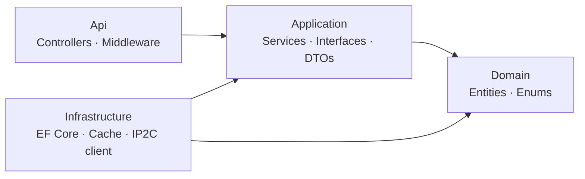

# NovibetFinalProject
<div align="center">

# 🌐 ExpressYourself
### IP Geolocation Service

A .NET 10 Web API that resolves IP addresses to countries, keeps that data fresh automatically, and reports on it.

`.NET 10` · `ASP.NET Core` · `EF Core / SQL Server` · `Clean Architecture` · `xUnit`

</div>

---

## 📑 Contents

- [Features](#-features)
- [Architecture](#-architecture)
- [Tech Stack](#-tech-stack)
- [Getting Started](#-getting-started)
- [API Summary](#-api-summary)

---

## ✨ Features

<table>
<tr>
<td width="60">🌍</td>
<td>

**IP Lookup** — `GET /api/ip/{address}`

Resolves an IP address to its country (name, ISO 2-letter and 3-letter codes) through a three-tier fallback, cheapest first:

| Tier | Source | Notes |
|:--:|---|---|
| 1 | **In-memory cache** | Configurable TTL |
| 2 | **Database** | Previously resolved IPs |
| 3 | **[IP2C](https://ip2c.org/)** | External API — result is persisted and cached for next time |

`400 Bad Request` for invalid addresses · `404 Not Found` for valid addresses with no known country

</td>
</tr>
<tr>
<td>🔄</td>
<td>

**Automatic Refresh** — background job

Re-checks every stored IP against IP2C on a configurable interval (default: **hourly**), processing records in batches so memory stays bounded. Only IPs whose country actually changed are written back and evicted from the cache — stored data stays accurate with zero manual intervention.

</td>
</tr>
<tr>
<td>📊</td>
<td>

**Country Report** — `GET /api/report`

Returns, per country, how many IP addresses are stored and when one of them was last updated — sorted by address count (descending), then alphabetically.

Optionally filter to specific countries:
```
GET /api/report?countryCodes=GR&countryCodes=IT
```

</td>
</tr>
<tr>
<td>🛡️</td>
<td>

**Consistent Error Handling**

A single exception-handling middleware turns unexpected failures and domain errors into clean `application/problem+json` responses — no internal details ever leak to API consumers.

</td>
</tr>
</table>

---

## 🏗️ Architecture



| Layer | Responsibility |
|---|---|
| **Domain** | Entities & enums — no dependencies |
| **Application** | Business logic, services, interfaces, DTOs |
| **Infrastructure** | EF Core (SQL Server), caching, IP2C client, background job |
| **Api** | Controllers, middleware, composition root |

> Each layer only depends on the ones inside it, keeping business rules independent of frameworks and I/O.

---

## 🧰 Tech Stack

| | |
|---|---|
| **Runtime** | .NET 10 / ASP.NET Core Web API |
| **Data** | Entity Framework Core + SQL Server |
| **Caching** | In-memory (`IMemoryCache`) |
| **Docs** | Swagger / OpenAPI |
| **Testing** | xUnit, SQLite in-memory, fake HTTP handlers |

---

## 🚀 Getting Started

### Prerequisites
- .NET 10 SDK
- SQL Server (local or remote)

### Configuration
Update `Api/appsettings.json` as needed:

| Section | Purpose |
|---|---|
| `ConnectionStrings:DefaultConnection` | SQL Server connection string |
| `Ip2C:BaseUrl` | IP2C API base URL |
| `Cache:TtlMinutes` | How long resolved IPs stay cached |
| `IpUpdateJob:Interval` / `BatchSize` | Refresh job frequency and batch size |

### Run
```bash
dotnet run --project Api
```
📎 Swagger UI is available at **`/swagger`** in Development.

### Test
```bash
dotnet test
```

---

## 📡 API Summary

| Method | Endpoint | Description |
|:--:|---|---|
| `GET` | `/api/ip/{address}` | Get country info for an IP address |
| `GET` | `/api/report?countryCodes=...` | Get address counts per country |

